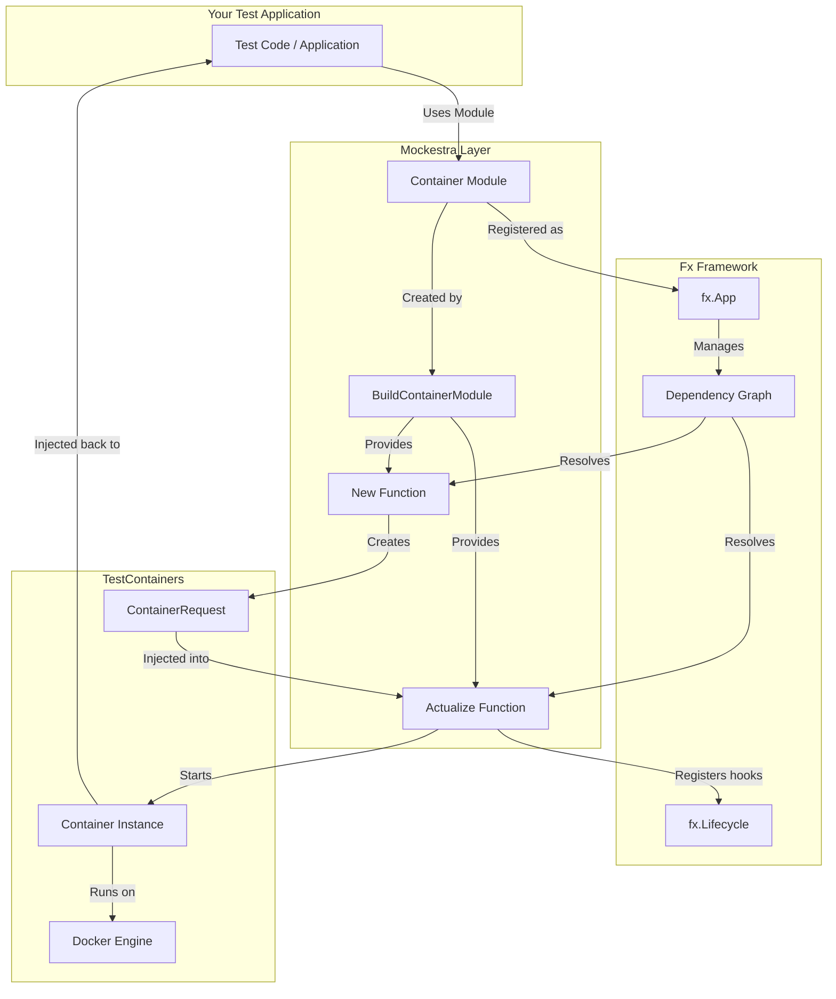
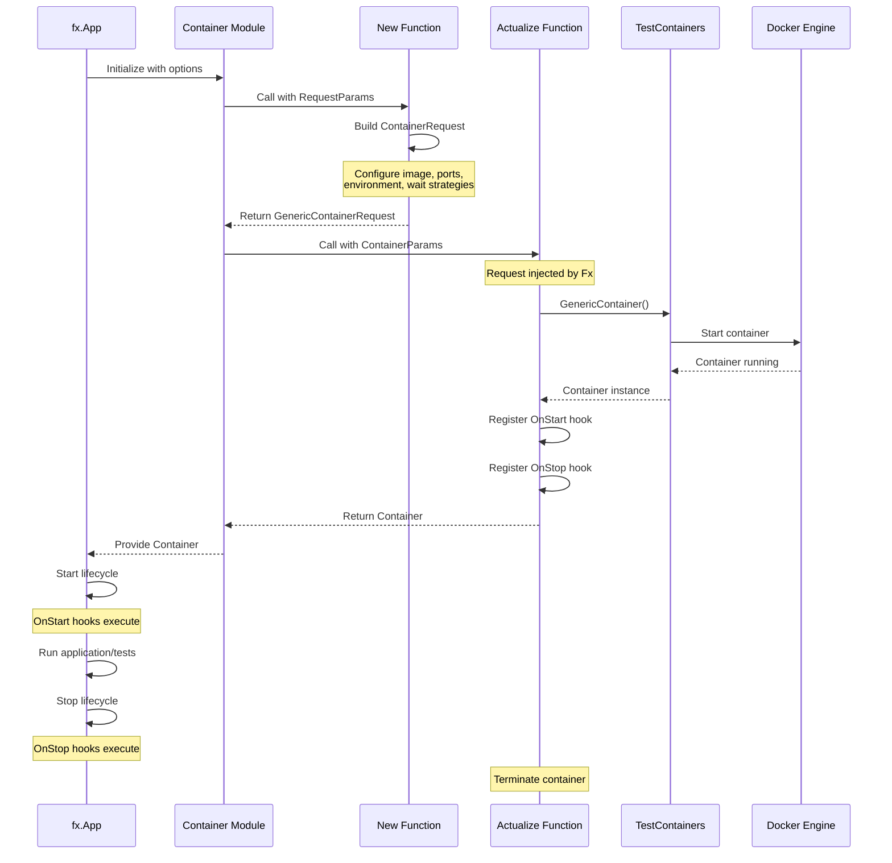
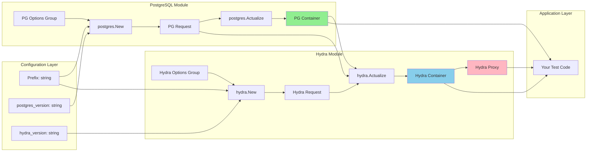

# Mockestra

**A modular, dependency-injected testing framework that orchestrates containerized services using Uber's Fx and TestContainers.**

## Table of Contents

- [What is Mockestra?](#what-is-mockestra)
- [Installation](#installation)
- [Core Concepts](#core-concepts)
- [Architecture](#architecture)
- [Available Modules](#available-modules)
- [Quick Start](#quick-start)
- [Advanced Usage](#advanced-usage)
- [How It Works with Fx](#how-it-works-with-fx)
- [Contributing](#contributing)

## What is Mockestra?

Mockestra is a Go library that bridges [Uber's Fx dependency injection framework](https://github.com/uber-go/fx) with [TestContainers](https://github.com/testcontainers/testcontainers-go) to provide modular, declarative testing infrastructure. It transforms popular container images into composable `fx.Option` modules that can be easily integrated into your testing and development workflows.

### Key Features

- **Dependency Injection Native**: Built on top of Uber's Fx, enabling clean dependency management and lifecycle control
- **Modular Architecture**: Each service (PostgreSQL, Redis, Temporal, etc.) is a self-contained module
- **Automatic Lifecycle Management**: Containers start and stop automatically with your application lifecycle
- **Type-Safe Configuration**: Leverage Go's type system for configuration and dependencies
- **Inter-Service Dependencies**: Automatically handles dependencies between services (e.g., Hydra depends on PostgreSQL)
- **Port Mapping & Proxying**: Automatic port discovery and optional TCP proxying for consistent service access
- **Testing-First Design**: Built specifically for integration testing with proper cleanup and isolation

## Installation

```bash
go get github.com/narwhl/mockestra
```

## Core Concepts

### 1. Container Modules

Each service in Mockestra is exposed as a **ContainerModule** - a higher-order function that wraps TestContainers configuration with Fx options:

```go
type ContainerModule func(values ...testcontainers.ContainerCustomizer) fx.Option
```

### 2. Three-Phase Lifecycle

Every module follows a consistent three-phase pattern:

1. **New**: Creates a `GenericContainerRequest` with configuration
2. **Actualize**: Instantiates the actual container and registers lifecycle hooks
3. **Module**: Exposes the module as an `fx.Option` for composition

### 3. Dependency Injection

Mockestra uses Fx's dependency injection to:
- Inject configuration (versions, prefixes, custom options)
- Manage inter-service dependencies (e.g., Hydra requires PostgreSQL)
- Provide containers to your test code

## Architecture

### High-Level Architecture



### Module Lifecycle Flow



### Fx Dependency Graph Example



## Available Modules

| Module | Image | Description | Dependencies |
|--------|-------|-------------|--------------|
| **postgres** | `postgres` | PostgreSQL relational database | None |
| **redis** | `redis` | Redis in-memory data store | None |
| **valkey** | `valkey/valkey` | Valkey (Redis fork) | None |
| **timescaledb** | `timescale/timescaledb` | TimescaleDB (Postgres extension) | None |
| **nats** | `nats` | NATS messaging system | None |
| **minio** | `minio/minio` | MinIO object storage | None |
| **versitygw** | `versity/versitygw` | Versity S3 Gateway | None |
| **temporal** | `temporalio/auto-setup` | Temporal workflow engine | None |
| **typesense** | `typesense/typesense` | Typesense search engine | None |
| **openfga** | `openfga/openfga` | OpenFGA authorization | None |
| **hydra** | `oryd/hydra` | Ory Hydra OAuth2 server | PostgreSQL |
| **kratos** | `oryd/kratos` | Ory Kratos identity server | PostgreSQL |
| **zitadel** | `ghcr.io/zitadel/zitadel` | ZITADEL identity platform | PostgreSQL |
| **concourse** | `concourse/concourse` | Concourse CI/CD | PostgreSQL |
| **mailslurper** | `oryd/mailslurper` | Email testing tool | None |
| **lgtm** | `grafana/otel-lgtm` | Grafana LGTM stack | None |

## Quick Start

### Basic Example: PostgreSQL

```go
package myapp_test

import (
    "context"
    "fmt"
    "testing"

    "github.com/jackc/pgx/v5"
    "github.com/narwhl/mockestra/postgres"
    "github.com/testcontainers/testcontainers-go"
    "go.uber.org/fx"
    "go.uber.org/fx/fxtest"
)

func TestWithPostgres(t *testing.T) {
    app := fxtest.New(
        t,
        // Supply required configuration
        fx.Supply(
            fx.Annotate("latest", fx.ResultTags(`name:"postgres_version"`)),
            fx.Annotate("myapp-test", fx.ResultTags(`name:"prefix"`)),
        ),
        
        // Add the PostgreSQL module
        postgres.Module(
            postgres.WithUsername("testuser"),
            postgres.WithPassword("testpass"),
            postgres.WithDatabase("testdb"),
        ),
        
        // Use the container in your code
        fx.Invoke(func(container testcontainers.Container) {
            endpoint, _ := container.PortEndpoint(
                context.Background(), 
                postgres.Port, 
                "",
            )
            
            conn, err := pgx.Connect(
                context.Background(),
                fmt.Sprintf(
                    "postgres://testuser:testpass@%s/testdb?sslmode=disable",
                    endpoint,
                ),
            )
            if err != nil {
                t.Fatalf("Failed to connect: %v", err)
            }
            defer conn.Close(context.Background())
            
            // Use your database connection
            var result int
            err = conn.QueryRow(context.Background(), "SELECT 1").Scan(&result)
            if err != nil {
                t.Fatalf("Query failed: %v", err)
            }
        }),
    )
    
    app.RequireStart()
    t.Cleanup(app.RequireStop)
}
```

### Multi-Service Example: Hydra + PostgreSQL

```go
func TestHydraWithPostgres(t *testing.T) {
    app := fxtest.New(
        t,
        fx.Supply(
            fx.Annotate("latest", fx.ResultTags(`name:"postgres_version"`)),
            fx.Annotate("v2.2.0", fx.ResultTags(`name:"hydra_version"`)),
            fx.Annotate("hydra-test", fx.ResultTags(`name:"prefix"`)),
        ),
        
        // PostgreSQL is required by Hydra
        postgres.Module(
            postgres.WithUsername("postgres"),
            postgres.WithPassword("secret"),
            postgres.WithDatabase("postgres"),
            postgres.WithExtraDatabase("hydra", "hydra", "hydrapass"),
        ),
        
        // Hydra automatically uses the PostgreSQL container
        hydra.Module(
            hydra.WithURL("http://localhost:4444"),
        ),
        
        fx.Invoke(func(
            pgContainer testcontainers.Container,
            hydraContainer testcontainers.Container,
        ) {
            // Both containers are available and connected
            // Hydra is configured to use PostgreSQL
        }),
    )
    
    app.RequireStart()
    t.Cleanup(app.RequireStop)
}
```

## Advanced Usage

### Custom Post-Ready Hooks

Execute custom logic after a container is ready:

```go
postgres.Module(
    postgres.WithUsername("user"),
    postgres.WithPassword("pass"),
    postgres.WithDatabase("db"),
    postgres.WithPostReadyHook(func(endpoints map[string]string) error {
        fmt.Printf("PostgreSQL is ready at: %s\n", endpoints["5432/tcp"])
        // Run migrations, seed data, etc.
        return nil
    }),
)
```

### Custom Migrations

```go
func runMigrations(dsn string) error {
    // Your migration logic
    return nil
}

postgres.Module(
    postgres.WithUsername("user"),
    postgres.WithPassword("pass"),
    postgres.WithDatabase("db"),
    postgres.WithMigration(runMigrations),
)
```

### Multiple Databases in PostgreSQL

```go
postgres.Module(
    postgres.WithUsername("admin"),
    postgres.WithPassword("adminpass"),
    postgres.WithDatabase("maindb"),
    // Create additional databases
    postgres.WithExtraDatabase("hydra", "hydra_user", "hydra_pass"),
    postgres.WithExtraDatabase("kratos", "kratos_user", "kratos_pass"),
)
```

### Version Management

```go
import "github.com/narwhl/mockestra"

fx.Options(
    mockestra.Versions(map[string]string{
        "postgres": "16-alpine",
        "redis":    "7-alpine",
        "temporal": "1.22.0",
    })...,
)
```

### Secret Generation

```go
secrets, err := mockestra.Secrets(map[string]uint{
    "db_password":    32,
    "api_secret":     64,
    "cookie_secret":  32,
})
```

## How It Works with Fx

### The BuildContainerModule Function

The core of Mockestra is `BuildContainerModule`, which wraps TestContainers with Fx:

```go
func BuildContainerModule(label string, options ...fx.Option) ContainerModule {
    return func(values ...testcontainers.ContainerCustomizer) fx.Option {
        // Groups all ContainerCustomizers under a label
        // Provides constructor functions (New, Actualize)
        // Returns a composable fx.Option
    }
}
```

### Dependency Injection Pattern

Each module follows this pattern:

```go
// 1. Define input parameters with fx.In
type RequestParams struct {
    fx.In
    Prefix  string                               `name:"prefix"`
    Version string                               `name:"postgres_version"`
    Opts    []testcontainers.ContainerCustomizer `group:"postgres"`
}

// 2. Constructor creates request
func New(p RequestParams) (*testcontainers.GenericContainerRequest, error) {
    // Build container request
}

// 3. Define container parameters
type ContainerParams struct {
    fx.In
    Lifecycle fx.Lifecycle
    Request   *testcontainers.GenericContainerRequest `name:"postgres"`
}

// 4. Define output with fx.Out
type Result struct {
    fx.Out
    Container      testcontainers.Container `name:"postgres"`
    ContainerGroup testcontainers.Container `group:"containers"`
}

// 5. Actualize creates container and registers lifecycle
func Actualize(p ContainerParams) (Result, error) {
    container, _ := testcontainers.GenericContainer(ctx, *p.Request)
    
    p.Lifecycle.Append(fx.Hook{
        OnStart: func(ctx context.Context) error {
            // Container is already running
            // Log connection details
        },
        OnStop: func(ctx context.Context) error {
            // Cleanup
            return container.Terminate(ctx)
        },
    })
    
    return Result{Container: container, ContainerGroup: container}, nil
}
```

### Fx Tags and Groups

Mockestra uses Fx tags extensively:

- **Named dependencies**: `name:"postgres"`, `name:"redis"`
- **Version tags**: `name:"postgres_version"`
- **Option groups**: `group:"postgres"`, `group:"hydra"`
- **Container groups**: `group:"containers"` for bulk operations

### Inter-Service Dependencies

Services can depend on each other by injecting containers:

```go
type ContainerParams struct {
    fx.In
    PostgresContainer testcontainers.Container                `name:"postgres"`
    PostgresRequest   *testcontainers.GenericContainerRequest `name:"postgres"`
    HydraRequest      *testcontainers.GenericContainerRequest `name:"hydra"`
}

func Actualize(p ContainerParams) (Result, error) {
    // Get PostgreSQL IP for Hydra to connect
    pgIP, _ := p.PostgresContainer.ContainerIP(context.Background())
    
    // Configure Hydra to use PostgreSQL
    // Then start Hydra container
}
```

## Contributing

Contributions are welcome! To add a new module:

1. Create a new package under the project root
2. Implement the three-phase pattern (New, Actualize, Module)
3. Follow the existing module structure
4. Add comprehensive tests
5. Update this README

## License

This project is licensed under the MIT License - see the [LICENSE](LICENSE) file for details.

